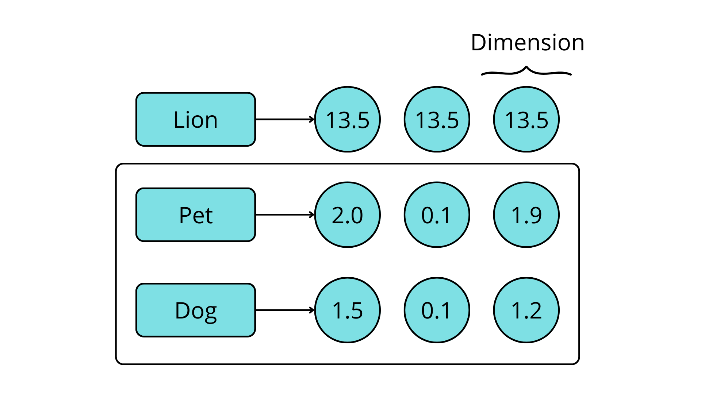
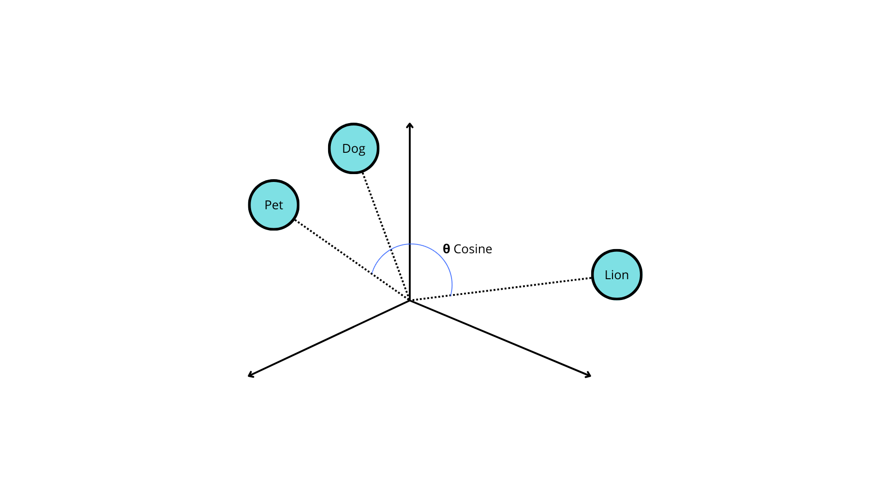
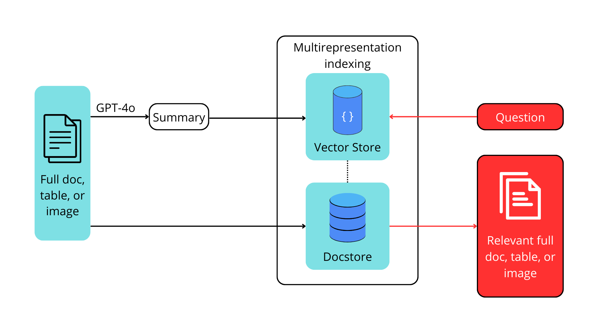
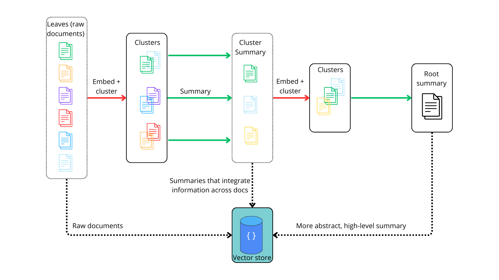
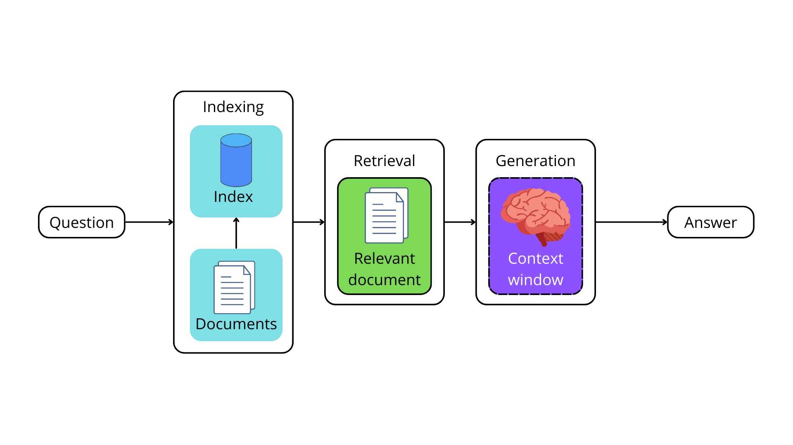
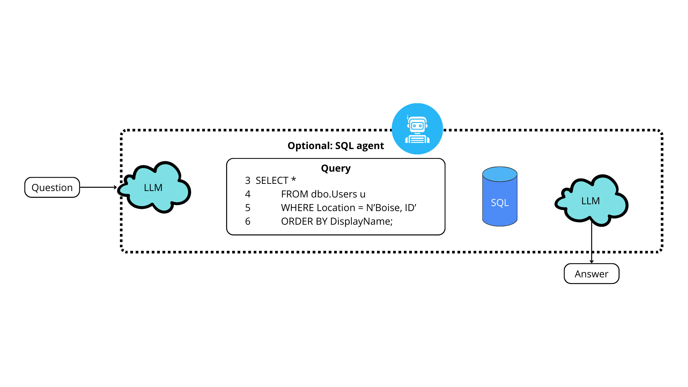
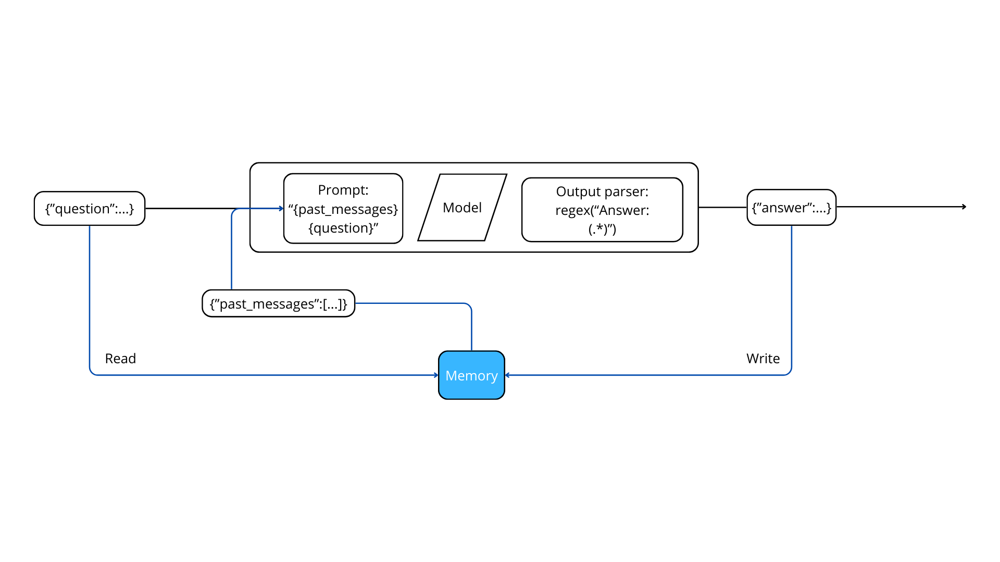
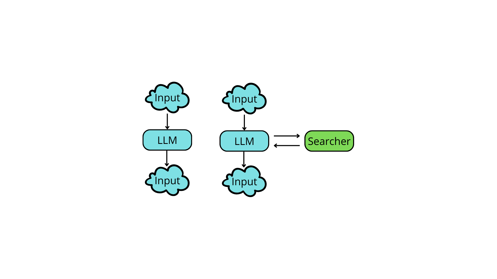

This repository contains information about LangChain.

# What is LangChain?
LangChain is an open source orchestration framework for the development of applications using large language models (LLMs). Available in both Python- and Javascript-based libraries, LangChain’s tools and APIs simplify the process of building LLM-driven applications like chatbots and virtual agents. More information can be read here: [LangChain](https://www.ibm.com/think/topics/langchain)


## LLMs
Are pretained models that can be used to generate text. They are trained on large datasets and can generate text that is coherent and contextually relevant to the user initial input or most commonly known as **prompt**.

If we for example give a prompt like:

```
Q: What is the capital of France is _____
```
The model will generate a response like:
```
A: Paris.
```
Under the hood, the LLM estiamtes the probability of a sequence of word(s) given a previous sequence of words.

> **Note:** The model makes predictions based on **tokens**, not words. A token represents an atomic unit of text, which can be a word, a subword, or a character.

The tokenization process is done by a tokenizer, which is a component that converts text into tokens.

LLMs use *transformer neural network arquitecture* to generate text. The transformer model is a deep learning model that is designed to handle sequential data using attention mechanisms. The transformer model is composed of an encoder and a decoder. The encoder processes the input sequence and generates a representation of it, which is then used by the decoder to generate the output sequence. Transformers are designed to understand the context off each word in a sentence by considering it in relation to every other word.

To train these models you need a large dataset, a lot of computational power and time. That's why it's easier to use a pre-trained model. LLMs aren't the same as Supervised ML models, they need to assemble input and output based on the training data. Which could be strategies such as removing the last word of a sentence, thus having an initial input and a target output.

> **Note:** RLHF (Reinforcement Learning from Human Feedback) is a technique that can be used to fine-tune a pre-trained model using human feedback. This technique allows the model to learn from human feedback in the form of rewards, which can be used to improve the model's performance.

## For chat format the following roles are defined:
| Role     | Description      |
| ------------- | ------------- |
| System | Used for the instructions and framing of the task |
| User | Actual task of question |
| Assistant | Output of the model |

## Prompt engineering techniques
> **Note**: Using prompt engineering techniques work better if a combination of some them is used.

### Zero-shot Prompting
This technique consists of simply instructing the model in order to do the desired request.

### Chain-of-thought
Give the model the time to think before producing the output. This is done by giving the model a sequence of tokens (an instruction) that are not part of the prompt, but that are used to give the model time to think before producing the output.

Example:
```
Think step by step.
Who could you consider to be the most famous person in the world?
```
Here the first sentence is the instruction and the second sentence is the prompt.

### Retrieval-Augmented Generation
This technique consists of finding relevant pieces of information, also known as context, from different sources and using them to generate the output. This technique is useful when the model generates responses that are not correct.

### Tool Calling
Consist of prepending the prompt with external functions that the model can use to generate the output. This should include a description of the function and how to signal in the output. Particularly useful for examples such as math problems.

Example:
```
Tools:

- calculator: This tool accepts math expressions and returns their result.

- search: This tool accepts search engine queries and returns the first search 
result.

If you want to use tools to arrive at the answer, output the list of tools and
inputs in CSV format, with this header row `tool,input`.
Who could you consider to be the most famous person in the world?
```

### Few-Shot Prompting
This focus is based on providing some questions and answers, which helps the model to learn to perform a new task withoyt the need of additional training or fine-tunning.

This approach counts with 2 options:

- Static few-shot prompting: The model is trained with a fixed set of questions and answers.
- Dynamic few-shot prompting: The model is trained with a dynamic set of questions and answers by picking the most relevant exmaples for each new query.

## Why LangChain is important?
LangChain is important because it provides a set of tools and APIs that simplify the process of building LLM-driven applications. These tools and APIs allow developers to focus on the application logic and user experience, rather than the complexities of working with LLMs.

By using LangChain, developers can quickly build and deploy LLM-driven applications, such as chatbots and virtual agents, without having to worry about the underlying infrastructure and implementation details. **LangChain** allows to use prompt techniques to improve the model's performance and generate more accurate and relevant responses.

Major LLM providers have their own syntax and APIs, which can be difficult to learn and use. LangChain provides a unified interface that abstracts away these differences, making it easier for developers to work with different LLMs.

> Note: Exercises will be done using Llama3 locally, firtly we will need to have installed ollama.

Then we will have to use CLI and run the following command:
```powershell
ollama run llama3
```

This will download Llama3 in the current directory and run it.

From there we can use :
```powershell
ollama pull llama3
```

Also a text embedding model will be used, which is a model that converts text into a numeric representation. This model is used to find the most relevant documents to answer questions.
```powershell
ollama pull mxbai-embed-large
```

> **Note**: llama3 latest does not support tools. As mentioned [here](https://ollama.com/search?c=tools), you could try instead with llama3.1

The next part of this notes will be located in the file `getting_started.ipynb`, as will go mainly with the exercises and examples of how to use Llama3. Click [here](getting_started.ipynb) to go to the file.

## RAGs
Simple models can be useful for certain tasks however, under most scenarios using a retrieval-augmented generation (RAG) model can be more beneficial. This model is a combination of a retriever and a generator, where the retriever finds relevant information from a knowledge source and the generator uses this information to generate the output. This technique is useful when the model generates responses that are not correct or there's information that the model is not aware of (trained).

This could include:
- Private data. As this information isn't publicly available, the model can't be trained on it.
- Current events. As the model is trained on historical data, it may not be aware of current events. As training data is a costly and time-consuming process, thus it may be trained until a certain date, this results in what is called the *knowledge cutoff*.

What it will end up happening is that the model most likely will hallucinate information, which means that it will generate information that is not correct or relevant to the prompt. Adapting the propmt won't resolve the issue either, because it relies on the model's current knowledge.

The main issue with making this data available to these models is a quantity problem. Thanks to RAGs models, you can pick the right information from a knowledge source and use it to generate the output.

To overcome this challenge it involves 2 steps:
1. **Indexing** your documents, basically preprocessing them in such a way that the application can find the most relevant information for each question.
2. **Retrieving** this external data and using it as context for the LLM to generate an accurate output based on your data.

If you for example would like to answer questions based on a document you can follow these steps:
1. *Extract* all the text from this particular document.
2. *Split* it into manageable chunks.
3. *Convert* these chunks into numbers that computers can understand.
4. *Store* these number representations of your text somewhere that makes it easy and fast to retrieve the relevant sections of your document to answer a given question.

Can be seen as the following table:
| Document | Convert to text | Split into chunks | Convert to numbers and store |
| ------------- | ------------- | ------------- | ------------- |
| Example.PDF | Text | Chunk 1 <br> Chunk 2 <br> Chunk 3 | Vector store <br> [0.1,0.2,0.5] |

This table exemplifies the preprocessing and transformation of the documents,this process is alsog known as **ingestion**. Put it in simple terms, it's converting your documents into numbers that computers can understand and analyze, and store them in a special type of database for efficient retrieval. These numbers are actually called **embeddings**, and the special type of database is known as a **vector store**.

As you may already know, machines don't work with text, they work only with numbers, **embedding** refers to representing text as a (long) sequence of numbers, also known as a vector. The benefit of vectors is actually that you can use them to do math operations.

Let's see an example of an embedding by using 3 sentences:
1. "What a sunny day."
2. "Such bright skies today."
3. "I haven’t seen a sunny day in weeks."

From there we count the number of unique words in the sentences, which are:
- What
- a
- sunny
- day
- such
- bright
- skies
- today
- I
- haven't
- seen
- in
- weeks

For each sentence, go word by word and asssign the number 0 if it's not present, 1 if used once in the sentencem 2 if present twicem and so on.

Then we can represent each word as a number, for example:
| Word | What a sunny day | Such bright skies today | I haven’t seen a sunny day in weeks |
| ------------- | ------------- | ------------- | ------------- |
| What | 1 | 0 | 0 |
| a | 1 | 0 | 1 |
| sunny | 1 | 0 | 1 |
| day | 1 | 0 | 1 |
| such | 0 | 1 | 0 |
| bright | 0 | 1 | 0 |
| skies | 0 | 1 | 0 |
| today | 0 | 1 | 0 |
| I | 0 | 0 | 1 |
| haven't | 0 | 0 | 1 |
| seen | 0 | 0 | 1 |
| in | 0 | 0 | 1 |
| weeks | 0 | 0 | 1 |

In this example the embedding for *I haven't seen a sunny day in weeks* would be:
```
[0,0,1,1,1,1,0,0,1,1,1,1,1]
```
This is called a **bag-of-words** model, and these embeddings are called **sparse embeddings** or sparse vectors, because a lot of the numbers in this vector are zeros.

> **Note**: Early NLP techniques don't suit for most advanced situations, further research used approaches such as **word2vec** and **GloVe** to generate embeddings that capture the meaning of words. These embeddings are called **dense embeddings** or dense vectors, because most of the numbers in this vector are not zeros. Also **Recurrent neural networks (RNNs)** and **Long short-term memory (LSTM)** networks were used to generate embeddings for sequences of words, such as sentences or paragraphs. This were more effective however, computational costs were high. **Transformers** were introduced to address this issue, and they are the basis for most LLMs.  By using the **self-attention mechanism**, that allows the model to learn contextual relationships between all words (or a set of tokens) in the input simulataneously, it does this by calculationg the importance of each word concerning other words in sequence. This attention is applied to derive contextual representations for downstream tasks such as language modeling or machine translation. One major benefit of the transformer architecture is its ability to perform parallel computation with a long sequence of words. Other models use alternative techniques, such as **generative adversarial networs (GANs)** or **variational autoencoders**. **GANs** have 2 networks, one that is tasked with generating synthetic samples that mimic real data *generator*, and another is a *discriminator* that tries to distinguish between real and synthetic samples. The generator is trained to fool the discriminator, and the discriminator is trained to detect the fake samples. **Variational autoencoders** are a type of neural network that learns to encode and decode data. The encoder network learns to 
the input data from the latent space. The latent space is a lower-dimensional representation of the input data that captures its most important features. The encoder and decoder networks are trained together to minimize the difference between the input data and the reconstructed data. The latent space can be used to generate new data samples by sampling from it and decoding the samples with the decoder network.

This model can be used for:

- **Keyword search**: You can find which documents contain a given word or words.

- **Classification of documents**: You can calculate embeddings for a collection of examples previously labeled as email spam or not spam, average them out, and obtain average word frequencies for each of the classes (spam or not spam). Then, each new document is compared to those averages and classified accordingly.

> **Note**: This model doesn't have awareness of the meaning, only the actual words used. If we check the embeddings fro *sunny day and bright skies* look very different. In fact they have no words in common, even though we know they have a similar meaning. Or for the email classification problem, a would-be spammer can trick the filter by replacing common "spam words" with their synonyms. **Semantic embeddings** address this limitation by using numbers to represent the meaining of the text, insted of the exact words found in the text.

## LLM-based embeddings
Embedding model can be seen as an offshot from the training process of LLMs. As discussed earlier LLMs training process enables them to complete a prompt (input) qith the most appropiate continuation (output). This capability stems from an understanding of the meaining of words and sentences in the context surrounding text, learned from how words are used together in the training texts. This **understanding** of the meaning (or semantics) of the prompt can be extracted as a numeric representation (or embedding) of the input text.

An **embedding model** then is an algorithm that takes a piece of text and putputs a numeric representation of the meaning of that text. Respresented as a long list of floating-point (decimal numbers), usually between 100 and 2000 numbers, or dimensions. This is called a **dense embedding** or **dense vector**. That is the opposite of a sparse vector, because most of the numbers in this vector are not zeros.

 > **Note**: Never compare embeddings generated by different models, as they are not compatible. The embeddings are unique to the model that generated them even if they share the same size.

 ### Semantic embeddings explained
 If we for example have three words: *lion*, *pet*, and *dog*. If we thinks which words have similar characteristics, the most obvious answer will be *pet* and *dog*. As humans we understand this, however machines don't so in order to translate them into the language of computers, which is numbers.

 Let's see this example:

 

 This image shows each word alongside its semantic embedding. If for example 2 words (or sentences) are close in meaning should be **closer in space** than those of unrelated words. As you can see, each number is a floating-point value, and each of them represents a semantic dimension. To understand a little bit better what **closer** in this context means, let's see the following image:

 
This image shows that the *pet* and *dog* vectors are closer to each other in distance that the **lion** vector. We can also observe that the angles between each plot varies depending on how similar they are. For example, *pet* and *lion* have a wider angle between one another than the *pet* and *dog* do, indicating more similarity between the latter word pairs. The narrower the angle or shorter the distance between two vectors, the closer their similarities.

One effective way to calculate the degree of similarity between two vectors in a multi-dimensional space is by using the **cosine similarity**. **Cosine similarity** computes the dot product of vectors and divides it by the product of their magnitudes to output a number between -1 an 1, where 0 means the vectors share no correlation, -1 means they are absolutely dissimilar, and 1 means they are absolutely identical. Here as an example, cosine similarity between *pet* and *dog* is 0.75, while the cosine similarity between *pet* and *lion* might be 0.1.

The ability to convert words or sentences into embeddings allow us to capture semantic menaing and then perform calculations to find semantic similarities between different sentences enable us to gent an LLM to find the most relevant documents to answers questions.

> Note: Embeddings have a number of interesting properties:
> - As discussed, points that are closer together have more similar meanings, so a distance function can be used to measure similarity.
> - Points close to each other can be said to be related; thus, a clustering algorithm can be used to identify topics (or clusters of points) and classify new inputs into one of those topics.
> - If you average out multiple embeddings, the average embedding can be said to represent the overall meaning of that group; that is, you can embed a long document by:
>   1. Embedding each page separately.
>   2. Taking the average of the embeddings of all pages as the book embedding.
> - There are models that can produce embeddings for nontext context, for instace, images, videos, and sounds, in addition to text. This enables for instance finding images that are most similar or relevant for a given sentence,
> At glance, embeddings have applications such as:
> - **Search**: To find the most relevant documents for a given query.
> - **Clustering**: Given a body of documents, dividing them into groups (for instance, topics)
> - **Classification**: Given a body of documents, labeling them as belonging to one of several categories.
> - **Recommendation**: Given a user's history, recommending new content that is similar to what they have liked before.
> - **Detecting anomalies**: Given a body of documents, finding the ones that are most different from the rest.

The next part of the document will be located in the file `rag.ipynb`, as will go mainly with the exercises and examples of how to use RAGs. Click [here](rag.ipynb) to go to the file.

## Indexing optimization
A basic RAG indexing stage involves naive text splitting and embedding of chunks of a given document. However, this approach leads to inconsistent retrieval results and a relatively high occurrence of hallucinations, especially when the data source contains images and tables. To address these issues we can use the following techniques:

### **MultiVectorRetriever**
If we have a document that contains text and tables, this information can't be simply split into chunks and embedded as context; this could cause the whole table to be lost. To address this issue, we can decouple documents that we want to use for answer synthesis, from a reference that we want to use for retriever. See the following image:



For this case, if a document contains tables, we can first generate and embed summaries of table elements, ensuring each summary contains an **id** reference to the full raw table. Then, we store the raw referenced tables in a separate docstore. Finally, when a user's query retrieves a table summary, we pass the entire referenced raw table as context to the final prompt sent to the LLM for answer synthesis. This approach allow us to provide the model with the full context of information required to answer the question.

Let's see an [example](src/multiVectorRetriever.ipynb) of how this works.

### **RAPTOR: Recursive Abstractive Processing for Tree-Oriented Retrieval**
RAG frameworks need to handle lower-level questions that reference specific facts found in a single document or higher-level questions that distill ideas that span many documents. Handling both types of questions can be a challenge with typical k-nearest neighbors (k-NN) retrieval over document chunks.

*Recursive abstractive processing for tree-organized retrieval (RAPTOR)* is an effective strategy that involves creating documents that capture higher-level concepts, embedding and clustering those documents, and then summarizing each cluster. This is done recursively, producing a tree of summaries with increasingly high-level concepts. The summaries and initial documents are indexed together, giving coverage across lower-to-higher-level user questions. As you can see in the following image:



### **ColBERT: Optimizing Embeddings

One of the current challenges of using embeddings models during the indexing stage, is that they compress text into vectors that capture the semantic content of the docuemtn. Although this is useful for retrieval, embedding irrelevant or redundant content may cause hallucinations in the final LLM output.

You can try the following approach to solve this problem:
1. Generate contextual embeddings for each token in the document and query.
2. Calculate and score similarity between each query token and all document tokens.
3. Sum the maximum similarity score of each query embedding to any of the document embeddings to get a score for each document.

This produces a more granular and effective embedding approach for better retrieval. Luckily, ColBERT embedding model embodies the solution to this problem. Here is an [example](https://python.langchain.com/docs/integrations/retrievers/ragatouille/) of how to use it along with RAGatouille.

By using ColBERT, you can improve the relevancy of retrieved documents used as context by the LLM.

# Introducing Retrieval-Augmented Generation (RAG)
RAG is a technique used to enhance the accuracy of outputs generated by LLMs by providing context from external sources, without using RAGs, LLMs are only using pretrained data, which can lead to hallucinations and inaccuracies in the output. To prevent this, we must ensure that we provide the LLM with actual, up-to-date information from which it can formualte an accurate response. In order to so, we eneed an automated system to fetch relevant information based on a user's query, append it as context to the prompt, and then execute the generation request to the LLM.

#### **Retrieving Relevant Documents**
A RAG system for an AI app typically follows 3 core stages:
- **Indexing**:
    This stage involves preprocessing the external data source and storing embeddings that represent the data in a vector store where they cam be easily retrieved.
- **Retrieval**:
    This stage involves finding the most relevant documents based on the user's query.
- **Generation**:
    This stage involves synthesizing the original prompt with the retrieved relevant documents as one final prompt sent to the model for predictions.

This process can be seen as the following image:


Let's see a full [example](src/ragFullExample.ipynb) of how to use RAGs starting with indexing stage.

## Query Routing
Using a single vector store is useful, however there are sometimes that you need data available in a variaty of data sources, including relational databases or other vector stores. For example one vector may be used for Langchain Python documentation, while another may be used for Langchain JavaScript documentation. In this case, given a user's question, we would like to *route* the query to the appropiate inferred data source to retrieve relevant docs. **Query routing** is a strategy used to forward a user's query to the relevant data source.

## Logical routing
In **logical routing**, we give the LLM knowledge of the various data sources at our disposal and then let the LLM reason which data source to apply based on the user's query.

In order to do that, we need a **function calling** model like LLAMA 3.1, or GPT-4o to help classify each query into one of the available routes. A function call involves defining a schema that the model can use to generate arguments of a function based on the query. This enable us to generate structured outputs that can be used to run other functions. Let's see an [example](src/logicalRouting.ipynb) of how to use it.

## Semantic Routing
This routing involves embedding various prompts that represent various data sources alongside the user's query and then performing vector similarity search to retrieve the most similar prompt. The following image gives an example: 


Let's see a [basic example](src/semanticRouting.ipynb) of how to use it.

## Query construction
**RAG** is an effective strategy to embed and retrieve relevant unstructured data from a vector store based on a query. But most available for use in production apps is structured and typically stored in relational databases. In addition, unstructured data embedded in a vector store also contains structured metadata that possesses important information.

*Query construction* is the process of transforming a natural language query into the query language of the database or data source you are interacting with. Fo example if we ask: What movies about aliens are from the year 1980? This question contains an unstructured topic that can be retrieved via embedding (aliens)

There are several ways to do this:

### 1. Text-to-Metadata Filter
Most vector stores provide the ability to limit your vector search based on metadata. During the embedding process, we can attach metadata key-value pairs to vectors in an index and then later specify filter expressions when you query in the index. LangChain provides a **SelfQueryRetriever** that abstracts this logic and makes it easier to translate natural language queries into structured queries for various data sources. The self-querying utilizes an LLM to extract and execute the relevant metadata filters based on a user's query and predefined metadata schema. Let's see a full [example](src/textToMetadataFilter.ipynb) of how to use it.

### 2. Text-to-SQL
SQL and relational databases are important sources of structured data, but they don't interact directly with natural language. Although we can simpy use the LLM ton translate a user's query to SQL queries, there is little margin for error.

Fo effective text to SQL translation you can do the following strategies:
- **Database Description**: To ground SQL queries, an LLM must have with an accurate description of the database. One common text-to-SQL prompt employs an idea reported in this paper and others: provide the LLM with a **CREATE TABLE** description for each table, including column names and types. We can also provide a few (for instance, three) example rows from the table.

- **Few-shot examples**: Feeding the prompt with few-shot examples of question-query matches can improve the query generation accuracy. This can be achieved by simply appending standard static examples in the prompt to gide the agent on how it should build queries based on questions.

The follow image shows a visual of the process:


The [following script](src/textToSQL.ipynb) shows a full example.

## Adding memory to chatbots using LangGraph
Large language models are *stateless*, this means that everytime you ask one new question, there is no memory about previous questions or responses. To keep historical information for the model, we need a robust memory system that will keep track of previous conversations and context. This previous information can be included in the final prompt sent to the LLM. The memory and retrieval used to generate context-aware answers from an LLM can be seen in the following image: 


There are 2 core design decisions behind any robust memory system:
* How state is stored
* How state is queried

A simple way to build a chatbot memory system that incorporates effective solutions to these desing decisions is to store and reuse the history of all chat interactions between the user and the model.The state of this memory system can be:

- Stored as list of messages.
- Updated by appending recent messages after each turn
- Appended into the prompt by inserting the messages into the prompt.

The following image shows a simple memory system:



Let's see an [example](src/simpleMemorySystem.ipynb)

> Note: While this is simple and works, when taking your application to production, more challenges will show related to managing memory at scale, such as:
>
> - You will need to update the memory after every interaction, atomically (i.e., don't record only the question or only the answer in the case of failure).
> - You want to store these memories in durable storage, such as relational database.
> - You want to control how many and which messages are stored for later, and how many of these are used for new interactions.
> - You will want to inspect and modify this state (for now, just a list of messages) outside a call to an LLM.

## LangGraph
This library was built to implement multiactor, multistep congnitive architectures, called **graphs**.

Is used for single-actor applications to multiactor applications as you can see in the following image:


An LLM propmt is much more powerful when paired up with a search engine (best at finding current facts), or even when paired with different LLM prompts. In order to do so, an application with multiple actors needs a coordination layer to do these things:

- Define the actors involved (the nodes in a graph) and how they hand off work to each other (the edges in that graph).
- Schedule execution of each actor at the appropiate time -in parallel if needed- with deterministic results.

As each actor hands off work to another, we need to make sense of the back-and-forth between multiple actors. We need to know what order it happens in, how many times each actor is called, and so on. To do this, we can model the interaction between the actors as happening across multiple discrete steps in time. When one actor hands off work to another actor, it results in the scheduling of the next step of the computation, and so on, until no more actors hand off work to others, and the final result is reached.

The following image shows an example of this process:


Communication across steps requires tracking some state-otherwise, when you call the LLM actor the second time, you'd get the same result as the first time. It is very helpful to pull this state out of each of the actors and have all actors collaborate on updating a single central state. With a single central state, we can:

- Snapshot and store the central state during or after each computation.
- Pause and resume execution, which makes it easy to recover from errors.
- Implement human-in-the-loop controls.

Each *graph* contains the following:

- *State*: The data received from outside the application, modified and produced by the application while it’s running.

- *Nodes*: Each step to be taken. Nodes are simply Python/JS functions, which receive the current state as input and can return an update to that state (that is, they can add to it and modify or remove existing data).

- *Edges*: The connections between nodes. Edges determine the path taken from the first node to the last, and they can be fixed (that is, after Node B, always visit node D) or conditional (evaluate a function to decide the next node to visit after node C).

Let's see a simple [LangGraph example](src/simple_chatbot.ipynb).

Persistent memory can be made using MemorySaver with Langchain Checkpoint or using SQLite, Postgres or other databases

```python

graph = builder.compile(checkpointer=MemorySaver())
```

# Cognitive Architectures with LangGraph
We can categorize several popular approaches to building LLM applications based on their position along a spectrum of autonomy—specifically, which of the three key tasks are handled by the LLM versus those managed by the developer or end user.  
These approaches are often referred to as **cognitive architectures**.

In the field of artificial intelligence, the term *cognitive architecture* traditionally refers to models of human reasoning and their computational implementations.  

A *step* is, for instance, retrieval of relevant documents (RAG), or calling an LLM with a chain-of-thought prompt.

## Levels of LLM Application Design

Below is a progression of common LLM application design patterns, ranging from traditional programming to increasingly autonomous cognitive architectures.

---

### **0: Code**
This level doesn’t involve LLMs at all—hence the label "0."  
It's simply conventional software development, where the logic and behavior are entirely defined by the developer.

---

### **1: LLM Call**
At this level, an application makes a single call to an LLM to complete a specific task—such as translating or summarizing text.  
This is typically part of a larger system where the LLM plays a supporting role.

---

### **2: Chain**
This involves multiple LLM calls executed in a predefined sequence.  
For example, a text-to-SQL app might include:

- **Step 1**: An LLM call that converts a user’s natural language query into a SQL query, using both the user input and a database schema provided by the developer.
- **Step 2**: A second LLM call that generates a plain-language explanation of the SQL query, helping the user verify that the query matches their intent.

---

### **3: Router**
Here, the LLM isn't just executing steps—it’s deciding **which** steps to take.  
Unlike the fixed sequence in a chain, a router dynamically selects from a set of predefined paths.

A common example is a RAG (Retrieval-Augmented Generation) system with multiple document indexes:

- **Step 1**: An LLM determines which index to query, based on the user's input and a description of each index.
- **Step 2**: The selected index is searched to retrieve the most relevant documents.
- **Step 3**: Another LLM call generates a final response using the retrieved documents and the original query.

---

Let's see the first architecture [LLM Call](src/LLM_Call_example.ipynb)

Second architecture can be seen in the following [script](src/LLM_chain.ipynb)

Router architecture example [click here](src/LLM_router.ipynb)

Now let's see agent architecture:
# Agent Architecture

In the field of artificial intelligence, there is a long history of creating **(intelligent) agents**, which can be most simply defined as _“something that acts,”_ in the words of Stuart Russell and Peter Norvig in their *Artificial Intelligence* (Pearson, 2020) textbook.

The word **acts** carries more meaning than meets the eye:

- Acting requires some capacity for **deciding what to do**.
- Deciding what to do implies **having access to more than one possible course of action**. A decision without options is no decision at all.
- In order to decide, the agent also needs access to **information about the external environment** (anything outside of the agent itself).

**What is an Agentic LLM Application?**

An **agentic LLM application** is one that uses a large language model to **pick from one or more possible courses of action**, given some context about the current state of the world or a desired next state.

These attributes are typically implemented by combining two prompting techniques:

---

1. Tool Calling

Include a list of **external functions** that the LLM can make use of in your prompt (i.e., the actions it can decide to take) and provide **instructions** on how to format its choice in the output it generates.

---

2. Chain-of-Thought Prompting

Researchers have found that LLMs _make better decisions_ when given instructions to reason about complex problems by breaking them down into granular steps. This is done either by:

- Adding instructions like **“think step by step”**
- Including **examples** of questions and their decomposition into multiple steps/actions

---

**Example Prompt (Using Both Techniques)**

```text
Tools:
search: this tool accepts a web search query and returns the top results.
calculator: this tool accepts math expressions and returns their result.

If you want to use tools to arrive at the answer, output the list of tools and
inputs in CSV format, with the header row: tool,input.

Think step by step; if you need to make multiple tool calls to arrive at the
answer, return only the first one.

How old was the 30th president of the United States when he died?

tool,input
```

**Example Output from Agentic LLM Prompt**

When the prompt is run against `gpt-3.5-turbo` with the following parameters:

- **Temperature**: `0` (ensures deterministic output, i.e., the LLM follows the desired format strictly)
- **Stop sequence**: `newline` (the LLM stops generating after one action)

The model produces a **single action**, as expected, because the prompt only asked for one. The output is returned in **CSV format**, just like the prompt instructed.

```text
search,30th president of the United States
```

More recent models have been fine-tuned to improve their performance for tool-calling and chain of thought applications, removing the need for adding specific instructions to the prompt.

```text
add example prompt and output for tool-calling model
```

## The Plan-Do Loop

What makes the **agent architecture** different from previous architectures is the concept of the **LLM-driven loop**.

### What is a loop?
Every programmer is familiar with the idea of a loop: executing the same logic multiple times until a stop condition is met. In agentic LLM systems, the **LLM controls** this stop condition.

In each iteration of the loop, the LLM:
1. **Plans** an action or tool to use.
2. **Executes** the selected tool.
3. **Decides** whether to stop or continue.

---

###  Example of a ReAct Agent Loop

We want to answer:  
**"How old was the 30th president of the United States when he died?"**

### Step 1: Initial Tool Selection

Prompt to the LLM:

```
tool,input
search,30th president of the United States
```

**Output from `search` tool:**

```
Calvin Coolidge (born John Calvin Coolidge Jr.; July 4, 1872 – January 5, 1933)
was an American attorney and politician who served as the 30th president 
of the United States from 1923 to 1929.
```

---

### Step 2: Use the Output of the Previous Tool

LLM is re-prompted with:

```
Tools:
- search: this tool accepts a web search query and returns the top results.
- calculator: this tool accepts math expressions and returns their result.
- output: this tool ends the interaction. Use it when you have the final answer.

Think step by step. If you need multiple tool calls, return only the first one.

How old was the 30th president of the United States when he died?

tool,input
search,30th president of the United States

search: Calvin Coolidge (born John Calvin Coolidge Jr.; July 4, 1872 – January 5, 1933)

tool,input
calculator,1933 - 1872
```

**Output from `calculator` tool:**

```
61
```

---

### Step 3: LLM Uses the Final Tool

Now the LLM has the needed data and completes the loop:

```
tool,input
output,61
```

---

###  Why This Matters

This agent architecture is called **ReAct** — short for **Reasoning and Acting**.  
The LLM reasons step-by-step and chooses actions (tools) accordingly.

### Key features:
- **Autonomous step selection**
- **Dynamic tool usage**
- **LLM decides when to stop**

This approach gives LLMs more **agency** and enables more flexible, intelligent systems.

Let's see an example of the ReAct A.K.A "The Plan-Do Loop" [here](src/LLM_Plan-Do_Loop.ipynb)

## Always calling a Tool First
In the **standard agent architecture**, the LLM is always tasked with deciding **which tool to call next**.  
This offers a major advantage:

-  **Flexibility**: The LLM can dynamically adapt the application's behavior based on each unique user query.

---

###  The Tradeoff: Unpredictability

However, this flexibility comes with a cost—**unpredictability**.  
There are cases where this is not ideal. For example, if you're building an app where:

> **The `search` tool should always be called first**

Then it might make more sense to **hardcode that step**, rather than asking the LLM to decide. Why?

---

###  Advantages of Hardcoding the First Tool Call

-  **Lower Latency**:  
  You eliminate the **initial LLM call** whose only purpose would be to decide to use the search tool—saving time and resources.

-  **More Reliable Behavior**:  
  Prevents the LLM from **mistakenly skipping** the search step in cases where it's actually needed.

---

###  When Not to Use This Strategy

If your application **doesn’t have a clear rule** like “always call this tool first,” then **imposing such a constraint can backfire**:

-  You might limit the agent's ability to reason dynamically.
-  It could reduce the system’s overall performance and flexibility.

---

##  Let’s See It in Practice

Next, we’ll walk through an [example](src/LLM_Always_Call_a_tool_first.ipynb) that **manually initiates a tool call** (like `search`) **before the LLM enters the decision loop**.

# More Agent Architectures

## Reflection (also known as self-critique)

This technique draws inspiration from human reasoning.  
It involves allowing your LLM application to **analyze its previous outputs and decisions**,  
enabling it to **learn from past iterations** and incorporate that reflection into future behavior.

By reflecting, the agent can:
- Identify past mistakes
- Refine strategies
- Improve consistency across interactions

Reflection is the creation of a loop between a creator prompt and a reviser prompt. It can be combined with other techniques including chain-of-thought and tool calling.

Let's see an [example](src/LLM_Reflection.ipynb)

## Subgraphs in LangGraph
Before diving into multi-agent architectures, it's important to understand a foundational concept in LangGraph that enables them: **subgraphs**.

A **subgraph** is simply a graph used as part of another (parent) graph.

---

Common Use Cases for Subgraphs

1. **Multi-agent Systems**  
   Subgraphs enable the modular design of agents that can work independently and collaboratively within a larger system.

2. **Code Reuse**  
   When a group of nodes is needed across multiple graphs, defining them as a subgraph allows you to reuse them without duplication.

3. **Team Collaboration**  
   Different teams can independently build and maintain subgraphs.  
   As long as the **subgraph’s interface** (i.e., input and output schemas) is respected, the parent graph doesn’t need to know the internal workings of the subgraph.

---

Two Ways to Add Subgraphs to a Parent Graph

1. Add a Node that Directly Calls the Subgraph

- Useful when the **parent graph and subgraph share the same state keys**.
- No need to transform state between the parent and the subgraph.

2. Add a Node that Calls a Function Which Invokes the Subgraph

- Ideal when the **parent and subgraph use different state schemas**.
- Allows for **custom transformation of state** before or after calling the subgraph.

---


Let’s take a look at how each of these integration methods works in practice.

### Calling a Subgraph Directly

The simplest way to create subgraph nodes is to attach a subgraph directly as a node.  
This method requires that the parent graph and the subgraph **share state keys**,  
as those keys are used for communication between the two graphs.

If the graphs do not share any state keys, refer to the next section on using custom transformation functions.

> Note:  
> If you pass **extra keys** to the subgraph node (keys not included in the shared schema),  
> they will be **ignored** by the subgraph.  
> Likewise, if the subgraph returns extra keys, they will be **ignored** by the parent graph.

Let’s take a [look](src/LLM_subgraph_call_directly.ipynb) at how this works in practice.


---

## Multi-agent

Just as teams of people can achieve more than individuals alone,  
some problems are better solved by **teams of LLM agents** working together.

In a multi-agent setup:
- Each agent can have a distinct role or specialization.
- Agents may collaborate, critique each other, or delegate tasks.
- Complex workflows can be distributed and coordinated for better performance and scalability.


## Useful metrics while fine-tunning a LLM model:
- **Loss**: This ranges from 0 to infinity. Indicates how well the model fits the training data. While validation loss shows how effective the model is at generalizing to new data. Lower loss values are better.
- **Perplexity**: This ranges from 1 to infinity: It measures a language model's ability to predict the next token in a sequence. Lower perplexity values are better.

## Summary of large documents
This can be done using *load_summarize_chain* method using *map_reduce* chain type. Here is a basic example of how to use it:
```python
from langchain.chains.summarize import load_summarize_chain

summary_chain = load_summarize_chain(llm=llm, chain_type="map_reduce", verbose=False)
```
Another example is available online [here](https://github.com/aws-samples/amazon-bedrock-workshop/blob/main/06_OpenSource_examples/text-generation-with-langchain/04_long_text_summarization_using_LCEL_chains_on_langchain.ipynb).